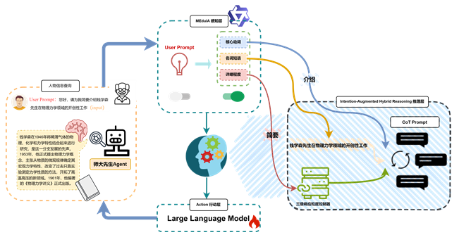
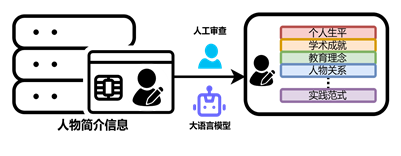

# chatMaster：基于意图增强型混合推理机制的人物科普教育Agent
# 师大先生 — 人物科普教育认知智能体 (MECA)

## 📌 项目简介

“师大先生”是基于意图增强型混合推理机制构建的人物科普教育认知智能体（Master Education Cognitive LLM Agent，MECA）。项目借助上海市各大高校权威名师库资源，以高质量的人物科普教育数据为支撑，构建了具有“三层认知架构”的智能教育 Agent，通过“意图感知 → 知识推理 → 教育执行”闭环决策范式，旨在实现教育服务在认知交互方面的全新升级。

---

## ✨ 核心特点

- **三层认知架构**  
  - **感知层-MEduIA：** 部署轻量级语言模型，对用户查询进行意图解构与需求映射。  
  - **推理层-意图增强型混合推理：** 设计并实现意图增强型混合推理机制，将领域知识、用户意图与教育策略的思维链推理进行深度融合。  
  - **行动层-大语言模型：** 采用 LoRA+监督微调的大语言模型作为教学执行器，实现认知过程与知识输出的精准对齐。

- **意图增强型混合推理机制**  
  通过用户意图驱动动态选择教学策略，充分挖掘模型内化的领域知识，从而提升科普教育问题的解决能力和交互质量。

- **高质量问答数据集**  
  基于上海各大高校权威名师库资源，构建了涵盖生平事迹、学术理念、教育贡献等多个维度的人物知识问答数据集，填补了国内该领域语料的空白。

---

## 🧠 项目架构

---

## 📚 数据集说明

该数据集主要基于上海市各大高校官方名师库的权威资源构建，特点如下：

- **数据精准对齐**：本文基于上海市各大高校权威名师库资源，结合人工筛查与GPT-4o模型的深度语义分析，系统性地整理各人物的简介信息，确保原始数据的准确性与一致性
- **内容维度**：本文在数据构建过程中，充分挖掘个人生平、学术成就、教育理念及人物关系等关键要素，为每位人物构建8至10组涵盖多个维度的高质量、细粒度、高灵活度问答对，共计2万余条
- **结构化语义**：问答不仅提供了事实性陈述，还引入“育人体系”、“实践范式”等结构化字段，以多维标注构建人物科普教育认知的时空语义图谱
......

---

## 📬 联系我们

- 📧 邮箱: `51275901093@stu.ecnu.edu.cn`  
- 🌐 项目主页: [GitHub](https://github.com/Moumou-lab/chatMaster)  
- 💬 参与讨论: [Discussions](https://github.com/Moumou-lab/chatMaster/discussions)
